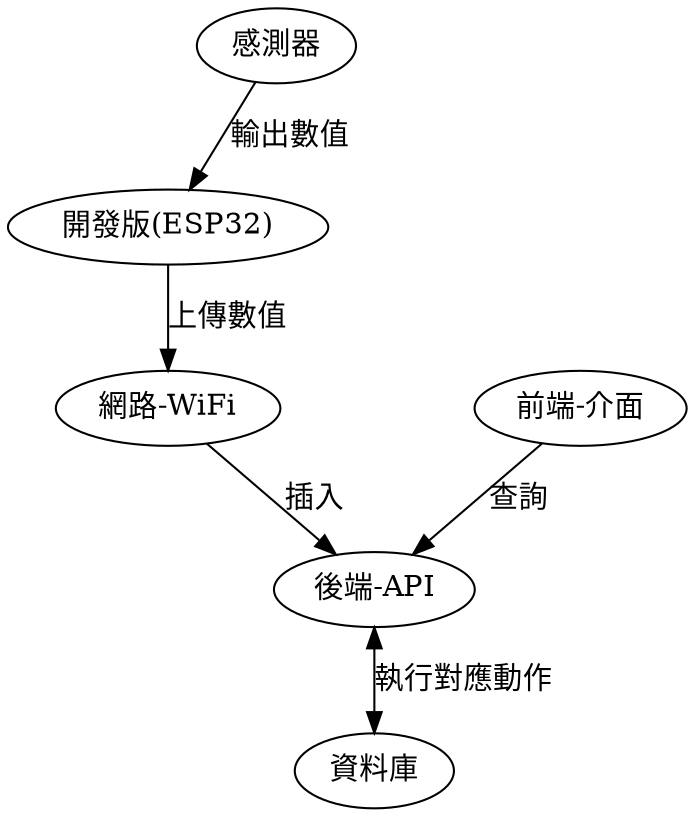

## 流程圖

```graphviz
digraph TD{
   A[label="感測器"];
   B[label="開發版(ESP32)"];
   C[label="網路-WiFi"];
   D[label="後端-API"];
   E[label="資料庫"];
   F[label="前端-介面"];
   null[style="invis"];
   A->B [label= "輸出數值" ];
   A->null[style="invis"];
   B->C [label= "上傳數值"];
   B->null[style="invis"];
   C->D[label="插入"]; 
   D->E[dir=both label="執行對應動作"];
   F->D [label= "查詢"];
}
```
---
## 實體架構

