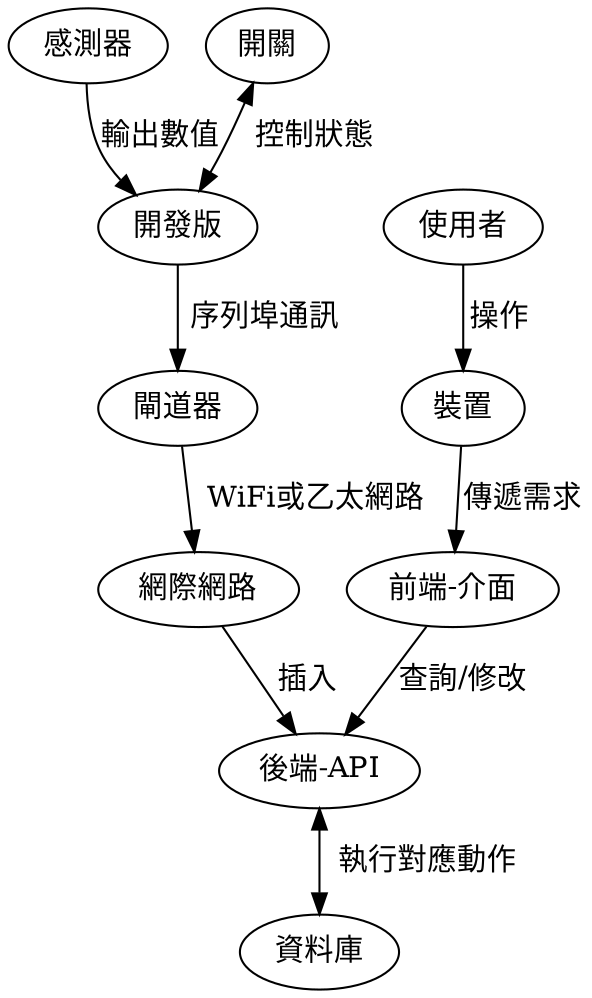

序列埠通訊
===

## 00 運行過程
### 0-1 緒論
當該程序己啟動時，則會從序列埠(USB)讀取各個開發版所輸出的字串資料且自動拆解成各自所需的值，然後在固定時間內自動傳送相關資料給伺服器的後端。

### 0-2 流程圖


## 01 發送端
### 技術
- 使用的程式語言: nodejs
  * 相關套件
    * axios: HTTP 發送
    * serialport: 序列埠通訊
        * @serialport/list
        * @serialport/parser-readline
  * 相關設置
    * 間隔時間: 6sec
    * 設置檔存放點: `/config`
      * 時間: `clockSet.cfg`
      * 裝置: `device.cfg`
### 啟動方式
- 主體: `npm start`
- 伺服器連線測試: `npm run server_test`

## 02 硬體輸出
### 輸出示意
- 主要是輸出字串
  ```
  device=Serial01,pm25=(Value),co=(Value)
  ```
### 相關程式
- Serial01
  ```c=
    #define deviceName "Serial01"
    Serial.println(String("device=")+deviceName+String(",pm25=")+ugm3+String(",co=")+COppm);
  ```
- Serial02
  ```c=
    #define deviceName "Serial02"
    void loop() {
      /*輸出至序列埠*/
      Serial.print("device=");
      Serial.print(deviceName);
      Serial.print(",hum=");
      Serial.print((int)humidity);
      Serial.print(",temp=");
      Serial.print((int)temperature);
      Serial.print(",o3=");
      Serial.print(sensorValue);
      Serial.print(",tvoc=");
      Serial.print("0");
      Serial.print(",co2=");
      Serial.print("0");
      Serial.println("");
      delay(3000);
    }
  ```
